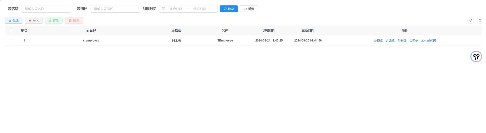
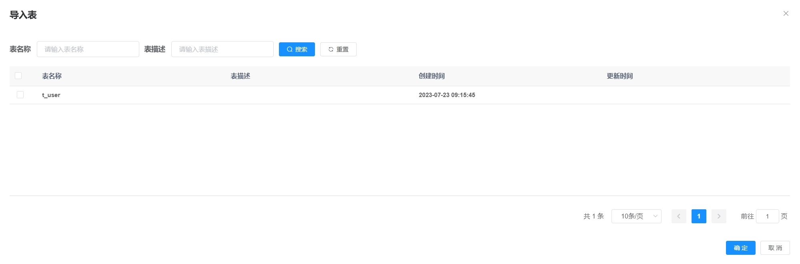
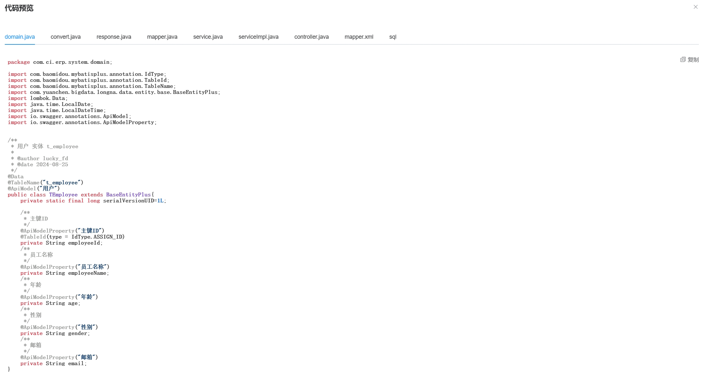

<p align="center" style="font-size: 30px">
    <strong>CodeGen - 基于SpringBoot的轻量级代码生成工具</strong>
</p>


## 项目介绍
Code-Gen 是一款高效、灵活的前后端代码生成工具，基于 SpringBoot 构建而成，旨在帮助开发者快速生成业务代码，从而节省宝贵的时间和精力。
通过自定义 Velocity 模板，Code-Gen 能够支持多种数据库（目前支持 MySQL 和 PostgreSQL），让代码生成变得前所未有的简单。


- 这个代码生成工具的初版是ruoyi的一个模块，后面为了方便日常开发使用，我进行了剥离重构，在原来的基础上做了一些优化升级，它在后续的开发中确实帮我节约了很多开发时间。
- 最开始框架只支持mysql，后面工作中遇到postgre数据库开发，为了能支持postgre数据库，自己又进行了二次升级。
- 项目支持生成后端MVC风格代码模板，以及生成前端Vue代码模板

## 项目特性

- 多数据库支持：无缝支持 MySQL 和 PostgreSQL，满足不同项目的数据库需求。
- 自定义模板：通过 Velocity 模板引擎，您可以轻松**自定义代码结构**，生成符合个人或团队规范的代码。
- 高效便捷：简化重复性编码工作，让您专注于核心业务逻辑的实现。
- 易于集成：基于 SpringBoot，可以快速集成到现有项目中，无需复杂的配置。
- 跨平台：Java 编写，可在任何支持 Java 的操作系统上运行。


## 为什么选择 Code-Gen？

- 节省时间：自动化生成代码，大大减少手动编码时间。
- 降低错误：通过模板生成的代码更规范，减少人为错误。
- 提高生产力：让开发者从繁琐的代码编写中解放出来，专注于更有价值的工作。
- 持续更新：项目持续维护，不断添加新功能和优化现有功能。
## 安装与使用
**系统要求**
- Java 1.8 或更高版本
- Maven 3.0 或更高版本
- MySQL 或 PostgreSQL 数据库


## 快速开始

1. 克隆项目到本地
```bash
git clone https://gitee.com/lucky-fd/code-gen.git
```
2. 后端gen-code启动，进入src/main/resources/application.yml，修改配置文件

> 配置项目数据库类型，目前仅支持mysql、postgresql
> ```aidl
> # 数据库支持 mysql postgresql。
> gen:
>  author: lucky_fd
>  database-type: mysql # 支持mysql、postgresql。选择数据库类型后，还需要配置相应数据库的数据源
>```
> 配置数据库类型后，更改数据源为自己的配置
> ```aidl
> # mysql 数据源配置
> spring:
> datasource:
> driver-class-name: com.mysql.cj.jdbc.Driver
> url: jdbc:mysql://127.0.0.1:3306/mydb?useUnicode=true&characterEncoding=utf8&zeroDateTimeBehavior=convertToNull&serverTimezone=GMT%2B8
> username: root
> password: mysql123.
> 
> # postgresql 数据源配置
> #spring:
> #  datasource:
> #    driver-class-name: org.postgresql.Driver
> #    url: jdbc:postgresql://127.0.0.1:5432/gen_code?useUnicode=true&characterEncoding=utf8&zeroDateTimeBehavior=convertToNull&useSSL=true&serverTimezone=GMT%2B8
> #    username: postgres
> #    password: 123456
> ```
> 导入代码生成相关的sql表到配置的数据库中，数据库表sql导入文件在doc目录下
> 
> 启动后台SpringBoot项目，控制台显示以下信息代表启动成功
> ```aidl
> (♥◠‿◠)ﾉﾞ  代码生成模块启动成功   ლ(´ڡ`ლ)ﾞ
>```


3. 前台项目启动，进入gen-ui目录

> 运行 npm install 命令，安装vue相关依赖（需提前装好node.js  [Node.js下载安装教程](https://blog.csdn.net/WHF__/article/details/129362462)）
> 
> 运行启动项目命令 npm run dev
> 
> 

4. 在ui界面，点击导入会显示数据库中所有未导入的表信息，选择需要生成业务代码的表，导入到项目中。
然后就可以在ui界面看到导入的表信息，我们可以编辑生成业务代码的一些配置信息，配置完可以点预览查看代码生成效果。







我们可以下载代码到本地，也可以直接在预览界面复制代码。

## 项目效果


## 贡献指南
我们欢迎任何形式的贡献，无论是新功能、改进还是错误修复。请遵循以下步骤：

1. Fork 仓库
2. 创建您的特性分支 (git checkout -b my-new-feature)
3. 提交您的更改 (git commit -am 'Add some feature')
4. 推送到分支 (git push origin my-new-feature)
5. 创建新的 Pull Request，提交到master分支
6. 等待作者合并


## 致谢
感谢所有使用和贡献 Code-Gen 的开发者！你们的反馈和建议是项目不断进步的动力。

